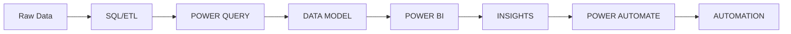
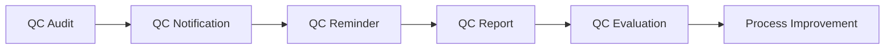
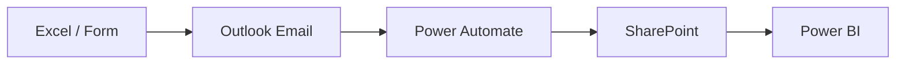
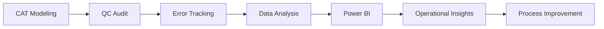
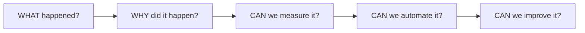
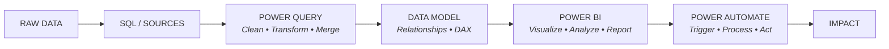

<div align="center">


<br>


<br><br>

<!-- PROFILE VIEWS -->


<br>

<a href="https://github.com/kramping28">

</a>

<a href="https://www.linkedin.com/in/mark-jayson-santos/">

</a>

<a href="mailto:markoliquinosantos@gmail.com">
 
</a> 

---

# 👋 About Me

I'm a **Data Analyst and Power BI Developer** focused on transforming
operational data into meaningful insights, automated workflows,
and reliable reporting solutions.

My work combines:

**📊 Data Analytics + 📈 Business Intelligence + ⚡ Automation + ✅ Quality Control**

I enjoy turning complicated or repetitive processes into solutions
that are easier to understand, measure, automate, and improve.



---

### 

# 🛠️ Tech Stack

### 📊 Data & Business Intelligence


<br>

### ⚡ Microsoft Power Platform


<br>

### 💻 Development & Tools


---

# 🚀 What I Do

<table>
<tr>
<td width="50%" valign="top" align="center">

### 📊 Data Analytics
*Transforming raw operational data into structured datasets and actionable insights.*

**Focus**
Data transformation • Data validation • Trend analysis  
Productivity analysis • Operational reporting • KPI development

</td>
<td width="50%" valign="top" align="center">

### 📈 Power BI
*Building interactive dashboards designed to make complex data easier to understand.*

**Focus**
Data modeling • DAX • Power Query  
Drill-through • Dynamic reporting • Performance analysis

</td>
</tr>
<tr>
<td width="50%" valign="top" align="center">

### ⚡ Automation
*Replacing repetitive manual processes with Microsoft Power Platform solutions.*

**Focus**
Power Automate • Power Apps • SharePoint  
Office Scripts • Outlook automation • Workflow design

</td>
<td width="50%" valign="top" align="center">

### ✅ Quality Control
*Using data and automation to improve quality monitoring and operational processes.*

**Focus**
QC audits • Error tracking • Quality reporting  
Root-cause analysis • Trend monitoring • Process improvement

</td>
</tr>
</table>

---

# 📌 Featured Projects

### 📊 Data Capacity & Utilization Dashboard
A Power BI analytics solution designed to monitor capacity, utilization, productivity, and forecasting.

`📊 Capacity` • `📈 Utilization` • `👥 Productivity` • `⚖️ Workload` • `🔎 LOB Analysis` • `📅 Forecasting` • `🚨 Underutilization` • `📋 Operational Reporting`

**Built With:** `Power BI` `DAX` `Power Query` `SQL` `Data Modeling`

<br>

### ✅ CAT Modeling QC Portal
A quality-control solution designed to centralize and automate the CAT Modeling audit process.



**Built With:** `Power Apps` `Power Automate` `SharePoint` `Excel Online` `Power BI`

<br>

### ⚡ Automated QC Workflow
Automation of repetitive quality-control processes using Microsoft Power Platform.



<br>

### 🌪️ CAT Modeling & Quality Control
Connecting operational data streams to drive continuous process improvement.



---

# 🧠 My Analytics Philosophy

**Good dashboards don't just display numbers. They answer questions.**



---

# 🏗️ Data Workflow



---

# 📊 GitHub Statistics


<br>

### 🔥 GitHub Streak


<br>

### 📈 Contribution Activity


<br>

### 🐍 Contribution Snake


---

# 🔥 Current Focus

📊 Advanced Power BI • 🧮 DAX & Data Modeling • 🗄️ SQL • 🧹 Power Query  
⚡ Power Automate • 📱 Power Apps • ✅ Quality Control Analytics  
🌪️ CAT Modeling Analytics • 📈 Operational Intelligence • 🔄 Process Automation

---

# 🎯 What I'm Building Toward

```
ACCURATE
▲
│
SCALABLE ◄───┼───► AUTOMATED
│
▼
ACTIONABLE
```

**Build analytics solutions that are:**  
`ACCURATE` • `AUTOMATED` • `SCALABLE` • `ACTIONABLE`

---

# 💡 A Little Data Humor

**SQL** ➔ *Finds it.* &nbsp;•&nbsp; **Power Query** ➔ *Cleans it.* &nbsp;•&nbsp; **DAX** ➔ *Calculates it.*  
**Power BI** ➔ *Visualizes it.* &nbsp;•&nbsp; **Power Automate** ➔ *Moves it.* &nbsp;•&nbsp; **QC** ➔ *Makes sure we can trust it.*

*And yes... 📊 I probably built a dashboard for it.*

---

# 📫 Let's Connect

<a href="https://github.com/kramping28">

</a>
<a href="https://www.linkedin.com/in/mark-jayson-santos/">

</a>
<a href="mailto:markoliquinosantos@gmail.com">
 
</a> 

<br>

<div align="center">
    


</div>


